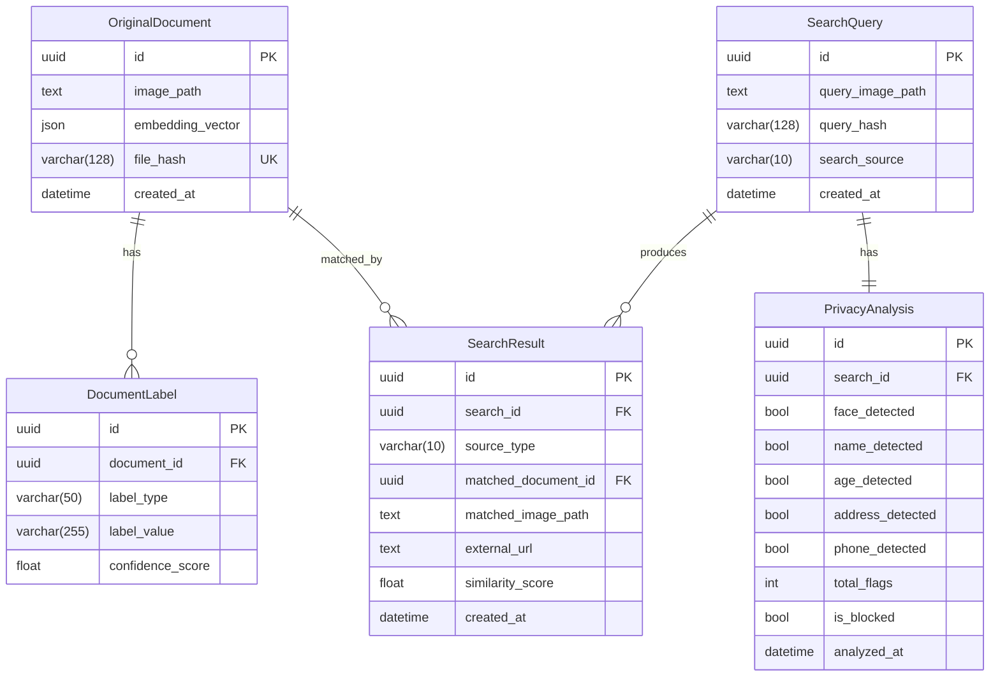

# Aplikasi Pencari Doksli — Sistem Deteksi Manipulasi Gambar


**Aplikasi Pencari Doksli** (Dokumen Asli) adalah aplikasi berbasis web untuk mendeteksi manipulasi gambar dengan fitur filter privasi otomatis dan pencarian kemiripan gambar menggunakan teknologi _Machine Learning_. Sistem mampu membandingkan gambar yang diunggah pengguna terhadap database dokumen asli secara lokal maupun melalui reverse image search di internet.

---

## Daftar Isi

- [Arsitektur Sistem](#-arsitektur-sistem)
- [Tech Stack](#-tech-stack)
- [Fitur Utama](#-fitur-utama)
- [Pipeline Pencarian](#-pipeline-pencarian)
- [Struktur Proyek](#-struktur-proyek)
- [Struktur Database](#-struktur-database)
- [Service Layer (Backend)](#-service-layer-backend)
- [Komponen Frontend](#-komponen-frontend)
- [API Endpoints](#-api-endpoints)
- [Instalasi & Menjalankan Proyek](#-instalasi--menjalankan-proyek)
- [Environment Variables](#-environment-variables)
- [Management Commands](#-management-commands)

---

## Arsitektur Sistem

```
┌─────────────────────────────────────────────────────────────┐
│                     FRONTEND (React + Vite)                 │
│  ┌──────────┐  ┌──────────┐ ┌──────────┐ ┌───────────────┐  │
│  │SearchPage│  │ResultPage│ │AdminPage │ │OriginalsPage  │  │
│  └────┬─────┘  └────┬─────┘ └────┬─────┘ └──────┬────────┘  │
│       └─────────────┴────────────┴──────────────┘           │
│                         Axios HTTP Client                   │
└────────────────────────────┬────────────────────────────────┘
                             │ REST API (JSON)
┌────────────────────────────┴────────────────────────────────┐
│                   BACKEND (Django + DRF)                    │
│  ┌─────────────────────────────────────────────────────┐    │
│  │                   API Layer (Views)                 │    │
│  └──────┬──────────┬──────────┬──────────┬─────────────┘    │
│         │          │          │          │                  │
│  ┌──────▼───┐ ┌────▼────┐ ┌───▼──────┐ ┌─▼──────────────┐   │
│  │ Privacy  │ │Embedding│ │Similarity│ │ Online Search  │   │
│  │ Service  │ │ Service │ │ Service  │ │ (Yandex/Vision)│   │
│  └──────────┘ └─────────┘ └──────────┘ └────────────────┘   │
│         │                      │                            │
│  ┌──────▼──────────────────────▼────────────────────────┐   │
│  │          PostgreSQL Database (UUID PKs)              │   │
│  └──────────────────────────────────────────────────────┘   │
└─────────────────────────────────────────────────────────────┘
```

---

## Tech Stack

### Frontend
| Teknologi | Versi | Fungsi |
|-----------|-------|--------|
| **React** | 18.2 | Library UI berbasis komponen |
| **Vite** | 5.x | Build tool & dev server (HMR) |
| **Tailwind CSS** | 3.4 | Utility-first CSS framework |
| **React Router DOM** | 6.20 | Client-side routing (SPA) |
| **Axios** | 1.6 | HTTP client untuk komunikasi API |

### Backend
| Teknologi | Versi | Fungsi |
|-----------|-------|--------|
| **Django** | 5.x | Web framework utama |
| **Django REST Framework** | 3.14+ | Serializer & API views |
| **PostgreSQL** | 15+ | Database relasional utama |
| **PyTorch** | 2.0+ | Framework deep learning (MobileNetV2) |
| **TorchVision** | 0.15+ | Pre-trained CNN models & transforms |
| **OpenCV** | 4.8+ | Deteksi wajah (Haar Cascade) + ORB feature matching |
| **ImageHash** | 4.3+ | Perceptual hashing (pHash) untuk deteksi gambar identik |
| **EasyOCR** | latest | Ekstraksi teks dari gambar (OCR) |
| **Google Cloud Vision API** | 3.5+ | Face detection, OCR, Web detection |
| **Requests** | 2.31+ | HTTP client untuk Yandex Reverse Image Search |
| **Pillow** | 10.0+ | Manipulasi gambar (resize, crop, ELA) |
| **NumPy** | 1.24+ | Operasi matriks & vektor |
| **psycopg2** | 2.9+ | PostgreSQL adapter untuk Python |
| **python-dotenv** | 1.0+ | Environment variable loader |

---

## Fitur Utama

### 1. Multi-Metric Reverse Image Search

Pipeline pencarian berbasis visual yang terdiri dari 4 lapisan strategi:

1. **Google Cloud Vision** (Primary) — Web detection via API
2. **Yandex `sites` mode** (Exact match) — Mencari halaman yang mengandung gambar identik
3. **Yandex `similar` mode** (Visual similarity) — Mencari gambar serupa secara visual
4. **Bing/icrawler** (Final fallback) — Keyword-based image crawling

### 2. Multi-Metric Re-Ranking (4 Metrik)

Setiap gambar kandidat dari internet di-ranking ulang menggunakan 4 sinyal komplementer:

| Metrik | Bobot | Fungsi |
|--------|-------|--------|
| **pHash** (Perceptual Hash) | 30% | Mendeteksi gambar dasar yang sama meski ditimpa teks/di-crop |
| **ORB** (Feature Keypoints) | 30% | Pencocokan struktur keypoint antar gambar |
| **Histogram** (Color Distribution) | 20% | Kemiripan distribusi warna |
| **CNN Embedding** (MobileNetV2) | 20% | Kemiripan semantik/konseptual |

> Gambar yang berbeda foto (meski orangnya sama) akan di-penalti 50% karena ORB ≈ 0.

### 3. Filter Privasi Otomatis

Sebelum diproses, gambar dianalisis untuk konten sensitif. **Blocked** jika ≥ 3 dari 5 kategori terdeteksi:

| Kategori | Metode Deteksi |
|----------|---------------|
| **Wajah** | OpenCV Haar Cascade + Histogram Equalization |
| **Nama** | Regex berbasis label kata kunci (toleran typo OCR) |
| **Umur** | Regex pola `XX tahun/thn/th` + format TTL |
| **Alamat** | Regex word-boundary berlapis (≥2 kata kunci unik) |
| **No. Identitas/Telepon** | Regex 16-digit (NIK) + pola telepon lokal/internasional |

### 4. Forensic ELA Analysis

Sistem menjalankan **Error Level Analysis (ELA)** pada setiap gambar yang diunggah untuk mendeteksi area manipulasi JPEG.

### 5. Perbandingan Visual Side-by-Side

Pengguna dapat mengklik hasil pencarian untuk membuka modal perbandingan gambar _query_ vs dokumen asli (_Doksli_) secara berdampingan.

### 6. Optimasi Storage

- Gambar kandidat dari web **tidak disimpan permanen** di server
- File sementara (`temp_candidates/`) dihapus otomatis setelah proses ranking selesai
- Database hanya menyimpan **URL eksternal** untuk hasil web

### 7. Tampilan Hasil Bertahap

- Halaman utama hanya menampilkan **3 hasil teratas** (Top 3)
- Detail lengkap (hingga 10 kandidat) tersedia di halaman **Lihat Selengkapnya**

---

## Pipeline Pencarian

```
[User Upload Image]
        │
        ▼
[Privacy Analysis] ──── blocked ──── [Return 403 Blocked]
        │ passed
        ▼
[Extract CNN Embedding]
        │
        ▼
[Local DB Search] ──── found ──── [Return Local Matches]
        │ not found
        ▼
[Google Cloud Vision] ──── found ──── ┐
        │ failed/empty                │
        ▼                             │
[Yandex Sites Mode]                   │
        │                             │
        ▼                             │
[Yandex Similar Mode]                 │
        │                             │
        ▼                             │
[Google Lens Attempt]                 │
        │                             │
        ▼                             │
[Bing Keyword Fallback]               │
        │                             │
        ▼                             │
[Download Candidates (max 10)]        │
        │                             │
        ▼                             │
[Multi-Metric Re-Ranking]   ◄─────────┘
  pHash + ORB + Hist + Emb
        │
        ▼
[Penalty: ORB<0.05 → score×0.5]
        │
        ▼
[Save External URLs to DB]
        │
        ▼
[Cleanup Temp Files]
        │
        ▼
[Return Ranked Results]
```

---

## Struktur Proyek

```
Capstone Project/
├── README.md
├── screenshot.png
├── .gitignore
│
├── backend/                          # Django Backend
│   ├── manage.py
│   ├── requirements.txt
│   ├── .env                          # Environment variables (tidak di-track Git)
│   │
│   ├── config/                       # Django project settings
│   │   ├── settings.py
│   │   ├── urls.py
│   │   └── wsgi.py / asgi.py
│   │
│   ├── api/                          # Django app utama
│   │   ├── models.py                 # Model database (UUID PK)
│   │   ├── serializers.py            # DRF serializers
│   │   ├── views.py                  # API views
│   │   ├── urls.py                   # API URL routing
│   │   ├── admin.py
│   │   └── management/commands/
│   │       └── import_doksli.py      # Bulk import CLI
│   │
│   └── services/                     # Business logic layer
│       ├── privacy_service.py        # Filter privasi (tanpa masking/sensor)
│       ├── embedding_service.py      # CNN feature extraction (MobileNetV2)
│       ├── similarity_service.py     # Multi-metric re-ranking (pHash+ORB+Hist+Emb)
│       ├── online_search_service.py  # Yandex/Google/Bing reverse image search
│       ├── vision_service.py         # Google Cloud Vision API wrapper
│       ├── forensic_service.py       # ELA (Error Level Analysis)
│       └── cropping_service.py       # Image preprocessing & cropping
│
└── frontend/                         # React Frontend
    ├── package.json
    ├── vite.config.js
    ├── tailwind.config.js
    └── src/
        ├── main.jsx
        ├── App.jsx
        ├── index.css
        ├── api/client.js
        ├── components/
        │   ├── Layout.jsx
        │   ├── Navbar.jsx
        │   ├── ParticleBackground.jsx
        │   ├── ImageUpload.jsx
        │   ├── PrivacyBadge.jsx
        │   ├── ResultCard.jsx        # Klikable → navigasi ke detail
        │   └── DocumentCard.jsx
        └── pages/
            ├── SearchPage.jsx        # Upload + Top 3 hasil
            ├── ResultDetailPage.jsx  # Detail + modal perbandingan
            ├── AdminPage.jsx
            └── OriginalsPage.jsx
```

---

## Struktur Database



---

## Service Layer (Backend)

### `online_search_service.py` — Reverse Image Search
Modul baru untuk mencari gambar asli di internet menggunakan reverse image search.

| Fungsi | Deskripsi |
|--------|-----------|
| `search_online()` | Entry point — menjalankan seluruh pipeline pencarian web |
| `_yandex_reverse_image_search()` | Upload gambar ke Yandex, ambil hasil `sites` & `similar` |
| `_google_vision_search()` | Web detection via Google Cloud Vision API |
| `_google_lens_search()` | Attempt scraping Google Lens (best-effort) |
| `_download_candidate_images()` | Download gambar kandidat ke folder temp |
| `cleanup_candidates()` | Hapus file temp setelah ranking selesai |

### `similarity_service.py` — Multi-Metric Re-Ranking
| Fungsi | Deskripsi |
|--------|-----------|
| `phash_similarity()` | Perceptual hash — deteksi gambar dasar yang sama |
| `orb_similarity()` | ORB keypoint matching — verifikasi struktur gambar |
| `histogram_similarity()` | Color histogram correlation |
| `re_rank_web_candidates()` | Re-ranking 4-metrik dengan penalti ORB≈0 |
| `find_most_similar()` | Pencarian lokal dengan cosine similarity |

### `forensic_service.py` — ELA Analysis
| Fungsi | Deskripsi |
|--------|-----------|
| `perform_ela()` | Error Level Analysis untuk deteksi manipulasi JPEG |
| `cleanup_ela_files()` | Hapus file ELA sementara |

### `privacy_service.py` — Filter Privasi
Modul inti yang menganalisis gambar untuk konten sensitif sebelum pemrosesan utama.

> **Update terbaru:** Sensor/masking gambar telah **dinonaktifkan**. Modul tetap menjalankan analisis deteksi untuk metadata privasi, namun gambar asli dikembalikan tanpa modifikasi.

| Fungsi | Deskripsi |
|--------|-----------|
| `analyze_privacy()` | Entry point utama — menjalankan seluruh pipeline deteksi |
| `_local_detect_faces()` | Deteksi wajah via OpenCV Haar Cascade + Histogram Equalization |
| `_local_detect_text()` | Ekstraksi teks via EasyOCR (bahasa Indonesia & Inggris) |
| `_detect_name_in_text()` | Deteksi nama menggunakan indikator kata kunci (toleran _typo_ OCR) |
| `_detect_age_in_text()` | Deteksi umur via regex pola `XX tahun` dan format TTL |
| `_detect_address_in_text()` | Deteksi alamat dengan _word-boundary_ berlapis (strict + loose) |
| `_detect_phone_in_text()` | Deteksi nomor telepon lokal (08x) dan internasional (+XX) |
| `_detect_nik_in_text()` | Deteksi NIK/No. Identitas (16-digit agresif) |
| `blur_pii_regions()` | ~~Masking PII~~ — dinonaktifkan, mengembalikan gambar asli |

**Regex Patterns:**
```python
# NIK — Sangat resilien terhadap spasi dan kesalahan OCR
NIK_PATTERN = r'\b\d[\d\sO]{14,20}\b'

# Telepon — Format lokal Indonesia & internasional
PHONE_PATTERN = r'(\+\d{1,4}[\s\-]?(?:\d[\s\-]?){7,14}|08[\s\-]?(?:\d[\s\-]?){7,12})'

# Umur — Pola numerik + kata kunci
AGE_PATTERN = r'\b(\d{1,3})\s*(?:tahun|thn|th)\b'

# TTL — Tempat Tanggal Lahir
TTL_PATTERN = r'(?:tempat|tgl|tanggal|lahir).{0,30}?\d{1,2}[\s\-/. ,]+\d{1,2}[\s\-/. ,]+\d{2,4}'
```

### `embedding_service.py` — Ekstraksi Fitur CNN
Menggunakan **MobileNetV2** (pre-trained ImageNet) sebagai _feature extractor_.

| Spesifikasi | Detail |
|-------------|--------|
| Model | MobileNetV2 (tanpa classifier) |
| Input | 224×224 RGB, ImageNet normalization |
| Output | Vektor 1280-dimensi, L2-normalized |
| Device | Auto-detect CUDA GPU → fallback CPU |
| Mode | Singleton loading, `torch.no_grad()` inference |

---

## Komponen Frontend

| Halaman | Route | Deskripsi |
|---------|-------|-----------|
| `SearchPage` | `/` | Upload gambar + tampilkan Top 3 hasil (klikable → detail) |
| `ResultDetailPage` | `/results/:id` | Detail lengkap + modal side-by-side perbandingan |
| `AdminPage` | `/admin` | Dashboard admin (login, upload, hapus dokumen) |
| `OriginalsPage` | `/originals` | Daftar dokumen asli tersimpan |

---

## API Endpoints

### Public
| Method | Endpoint | Deskripsi |
|--------|----------|-----------|
| `POST` | `/api/search/` | Upload gambar → analisis privasi + pencarian |
| `GET` | `/api/results/<uuid>/` | Detail hasil pencarian |
| `GET` | `/api/originals/` | Daftar dokumen asli |

### Admin
| Method | Endpoint | Deskripsi |
|--------|----------|-----------|
| `POST` | `/api/admin/login/` | Login admin |
| `POST` | `/api/add-original/` | Upload dokumen asli baru |
| `DELETE` | `/api/admin/originals/<uuid>/` | Hapus dokumen |

---

## Instalasi & Menjalankan Proyek

### Prasyarat
- **Python** 3.10+
- **Node.js** 18+ & npm
- **PostgreSQL** 15+

### 1. Clone Repository
```bash
git clone https://github.com/mezuuu/Aplikasi-Pencari-Doksli.git
cd Aplikasi-Pencari-Doksli
```

### 2. Setup Backend
```bash
cd backend
python -m venv venv
venv\Scripts\activate       # Windows
pip install -r requirements.txt
cp .env.example .env        # Edit sesuai kebutuhan
python manage.py migrate
python manage.py runserver
```

### 3. Setup Frontend
```bash
cd frontend
npm install
npm run dev
```

### 4. Akses Aplikasi
| Service | URL |
|---------|-----|
| Frontend | http://localhost:5173 |
| Backend API | http://localhost:8000/api/ |
| Django Admin | http://localhost:8000/admin/ |

---

## Environment Variables

```env
# Django
SECRET_KEY=your-secret-key-here
DEBUG=True

# Database (PostgreSQL)
DB_NAME=doksli_db
DB_USER=postgres
DB_PASSWORD=your-db-password
DB_HOST=localhost
DB_PORT=5432

# Google Cloud Vision API (opsional)
GOOGLE_CLOUD_API_KEY=your-api-key-here
GOOGLE_APPLICATION_CREDENTIALS=path/to/service-account.json

# Privacy Filter
PRIVACY_FLAG_THRESHOLD=3

# Admin Credentials (default untuk development)
# Username: admin
# Password: set via `python manage.py createsuperuser`
```

---

## Management Commands

### Bulk Import Dokumen Asli
```bash
python manage.py import_doksli "D:\path\to\image\directory"
```

**Output:**
```
Bulk import completed!
Success: 10
Skipped: 205
Errors : 0
Total  : 215
```

---

## Catatan Teknis

- **Google Lens** tidak dapat di-scrape secara programatik (diblokir Google sejak 2025). Sistem menggunakan Yandex sebagai alternatif reverse image search utama.
- **Gambar kandidat web tidak disimpan permanen** — folder `media/temp_candidates/` dibersihkan otomatis setiap selesai satu pencarian.
- **Sensor/masking dinonaktifkan** — gambar yang diunggah pengguna ditampilkan dalam kondisi asli.
- Sistem berjalan otomatis pada **CPU maupun GPU** tanpa fine-tuning (pre-trained inference only).

---

> Proyek ini dikembangkan sebagai bagian dari **Capstone Project**.

---

## Changelog

### v2.0 — Multi-Metric Reverse Image Search (Mei 2025)

#### Fitur Baru
- **Yandex Reverse Image Search** menggantikan DuckDuckGo/Bing sebagai engine pencarian visual utama, dengan dua mode: `sites` (exact match) dan `similar` (visual similarity).
- **Multi-Metric Re-Ranking** — sistem ranking baru menggunakan 4 metrik komplementer (pHash 30% + ORB 30% + Histogram 20% + Embedding 20%) untuk mendeteksi gambar asli yang ditimpa teks.
- **Penalti ORB** — kandidat yang berbeda foto meski orangnya sama akan di-penalti 50% jika ORB ≈ 0.
- **Forensic ELA Analysis** (`forensic_service.py`) — deteksi area manipulasi JPEG menggunakan Error Level Analysis.
- **Perceptual Hash** (`phash_similarity`) dan **Histogram Similarity** (`histogram_similarity`) ditambahkan ke `similarity_service.py`.
- **`online_search_service.py`** — modul baru yang mengelola seluruh pipeline pencarian web (Google Vision → Yandex Sites → Yandex Similar → Google Lens → Bing fallback).

#### Perubahan Backend
- `SearchResult` model: tambah kolom `matched_image_path` dan `external_url` (migration `0002`, `0003`).
- Gambar kandidat web **tidak lagi disimpan permanen** di server. File temp dihapus otomatis via `cleanup_candidates()` setelah ranking selesai.
- Serializer: `matched_image_url` kini mendukung fallback ke `external_url` untuk hasil web.
- **Sensor/masking dinonaktifkan** (`blur_pii_regions` dikembalikan langsung tanpa proses).
- Maksimal **10 kandidat** yang diunduh dan dibandingkan per sesi pencarian.

#### Perubahan Frontend
- `SearchPage`: hanya menampilkan **Top 3 hasil** di halaman utama, lengkap dengan navigasi klik ke halaman detail.
- `ResultDetailPage`: menampilkan seluruh kandidat (hingga 10) dengan modal perbandingan side-by-side.
- `ResultCard`: mendukung prop `onClick` untuk navigasi langsung ke detail.

#### Bug Fix
- **TypeError** pada `SearchResult.objects.create` akibat field `metadata` yang tidak ada di model database — dihapus dari kode.

---

> _Seluruh sistem ini dirancang untuk berjalan otomatis pada environment CPU maupun GPU tanpa memerlukan fine-tuning atau pelatihan model (pre-trained inference only)._
